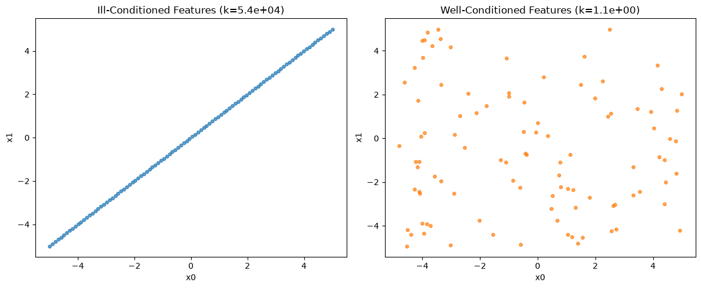
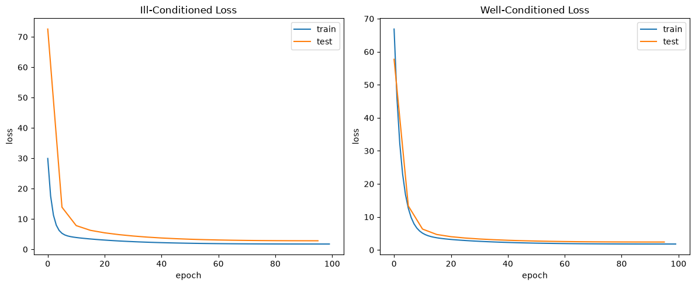
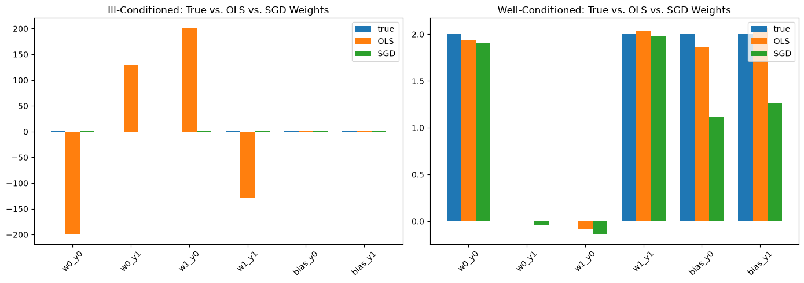
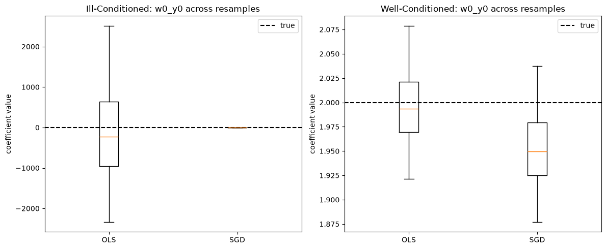

# Ill-Conditioned Linear Regression: OLS vs. SGD

An experiment built on top of **tiny-torch** that compares two ways of
fitting the same linear regression model — the **closed-form OLS solution**
(normal equations) and **SGD** — to see how each one responds to
**ill-conditioned** input features (near-multicollinearity).

A linear regression model can look like it is fitting well — low prediction
error — while its learned coefficients are almost meaningless. The culprit is
the **condition number** of the input features: when two features are nearly
collinear, the loss surface stops having a single sharp minimum and turns
into a long, shallow valley. Many different combinations of weights sit at
essentially the same loss, so both the exact closed-form solution and
gradient descent are free to land on very different individual coefficients
depending on noise — even though every one of them predicts almost as well as
the rest. What differs is *how much* each fitting method is thrown off by it.

The function used to generate targets is:

```
f(X) = 2·X + 2      (applied elementwise to a 2-feature input)
```

Two datasets are built from the same `f`, differing only in how the two input
features relate to each other. Both OLS and SGD are then fit on each dataset,
so their behavior can be compared side by side.

---

## The two datasets

**Ill-conditioned.** The second feature is built as a near-copy of the first:

```python
x0 = np.linspace(-5, 5, DATASET_SIZE)
x1 = x0 + EPS * rng.standard_normal(DATASET_SIZE)   # EPS = 1e-4
X = np.stack([x0, x1]).T
```

`x1` tracks `x0` almost exactly, with only a tiny amount of independent noise
(`EPS = 1e-4`) breaking the perfect correlation. The resulting design matrix
has a measured condition number of **k(X) ≈ 53,975** — the two columns are
nearly linearly dependent.

**Well-conditioned.** The two features are drawn independently:

```python
x0 = rng.uniform(-5, 5, DATASET_SIZE)
x1 = rng.uniform(-5, 5, DATASET_SIZE)
X = np.stack([x0, x1]).T
```

With no relationship between the columns, the condition number drops to
**k(X) ≈ 1.10** — about as well-behaved as a design matrix gets.

Both datasets are otherwise identical: `100` samples, targets computed as
`f(X)` and then perturbed with uniform noise (`NOISE = 2`), and split 90% / 10%
into train and test tensors via a shared `build_dataset()` helper, each
wrapped in a `TensorDataset` + `DataLoader` (full-batch).



The scatter plots make the difference visible directly: the ill-conditioned
features collapse onto a single line (`x1 ≈ x0`), while the well-conditioned
features fill the plane with no discernible relationship.

---

## Method 1: Closed-form OLS

OLS solves for the coefficients that minimize squared error directly, via the
normal equations, with a bias column appended to `X`:

```python
def fit_ols(X, y):
    A = np.hstack([X, np.ones((X.shape[0], 1))])
    return np.linalg.inv(A.T @ A) @ A.T @ y
```

This is exact for well-behaved data, but it is also the textbook example of
numerical instability under multicollinearity: the condition number of
`XᵀX` is the **square** of the condition number of `X`, so any noise in `y`
gets amplified enormously once the columns of `X` are nearly collinear.

## Method 2: SGD

Each dataset also gets its own copy of the same architecture — a single
`Linear(2, 2)` layer — trained with plain SGD and a cosine learning-rate
schedule via a `Trainer`:

```python
model = Sequential(Linear(2, 2))
loss = MSELoss()
optimizer = SGD(model.parameters, MAX_LR)          # MAX_LR = 1e-2
scheduler = CosineSchedule(MAX_LR, MIN_LR, EPOCHS)  # MIN_LR = 1e-4, EPOCHS = 100
trainer = Trainer(model, loss, optimizer, scheduler)
```

Two independent `Trainer`s (`trainer_ill` / `trainer_well`) run for
`EPOCHS = 100`, logging the test loss every `EVAL_STEP = 5` epochs:

```python
for i, epoch in enumerate(range(EPOCHS)):
    _ = trainer.train_epoch(train_loader, 1)

    if i % EVAL_STEP == 0:
        _ = trainer.eval(test_loader)
```

`train_epoch()` runs the forward/backward/optimizer-step internally and logs
the loss into `trainer.history`; loss curves are read back from
`trainer.train_loss` / `trainer.eval_loss`.



Both runs converge smoothly, and their train/test loss curves look
unremarkable — nothing in this plot hints that anything is wrong with the
ill-conditioned run, or that OLS and SGD will disagree so strongly.

---

## Measuring the damage: predictions vs. weights

Convergence of the loss alone doesn't reveal the problem. The notebook
instead compares, for each dataset, both fitted models (OLS and SGD) against
the **true coefficients** on two axes:

- **Prediction residual** — `mse(predictions, true_function(X_test))`
- **Weight residual** — `mse(coefficients, true_coefficients)`

```
dataset method   pred residual   weight residual
ill    OLS            0.1522        18982.2187
ill    SGD            1.2729            0.8094
well   OLS            0.0376            0.0058
well   SGD            0.6963            0.2262
```

(Exact figures vary run to run — the noise added to the targets isn't fixed
across every draw — but the gap between the two ill-conditioned weight
residuals is consistent across runs.)

The prediction residual stays small for both methods on both datasets. The
weight residual tells a completely different story: on the ill-conditioned
data, OLS's weight residual is **four orders of magnitude** larger than
SGD's, while on the well-conditioned data both stay small and roughly the
same order of magnitude (SGD's is somewhat higher there simply because it's
an approximate, finite-iteration fit, not because of conditioning).



Plotting true vs. OLS vs. SGD weights makes the gap obvious: on the
well-conditioned dataset all three bars for each weight line up closely,
while on the ill-conditioned dataset OLS swings wildly — even flipping sign —
while SGD stays in a much more plausible range, despite neither one
recovering the true coefficients exactly.

---

## Coefficient stability under resampling

A single fit isn't enough to judge stability — one noise draw could make
either method look better or worse than it really is. The notebook redraws
the noise on `y` 30 times, refits both OLS and SGD on each resample, and
measures how much the estimated coefficients move around:

```
Coefficient std-dev across resamples (ill-conditioned data):
  OLS: 786.01
  SGD: 0.3402

Coefficient std-dev across resamples (well-conditioned data):
  OLS: 0.0694
  SGD: 0.0556
```



On the well-conditioned dataset, OLS and SGD are equally stable across
resamples. On the ill-conditioned dataset, OLS's coefficients swing by more
than **2000x** more than SGD's — SGD, run for a fixed number of epochs, never
takes the large steps needed to reach the extreme solutions OLS lands on;
its early stopping acts as an implicit regularizer. Neither method recovers
the true coefficients exactly, since the problem itself is nearly
unidentifiable along the collinear direction — but SGD is far more
*consistent* about which wrong answer it gives.

---

## Why it happens

When two features are nearly collinear, infinitely many `(w0, w1)` pairs
along the direction of collinearity produce almost the same predictions —
because `w0·x0 + w1·x1 ≈ (w0 + w1)·x0` when `x1 ≈ x0`. The loss only
constrains the *sum* `w0 + w1` tightly; how that sum is split between the two
weights is barely constrained at all. The exact OLS solver is free to ride
that shallow valley as far as floating-point noise allows — amplified by the
fact that `κ(XᵀX) = κ(X)²`. SGD, in contrast, only takes as many steps as it
is given; with a fixed, modest epoch budget it simply never travels far
enough along the valley to reach those extreme, cancelling coefficients. That
is exactly what the huge weight residual and coefficient variance capture:
not a training failure, but a fundamentally **ill-posed estimation problem**
that the two fitting methods handle very differently.

This is the practical danger of multicollinearity: a model can pass every
predictive check on held-out data and still have coefficients that are not
trustworthy — flipping sign, exploding in magnitude, or changing drastically
with small perturbations to the data — which matters whenever the
*coefficients themselves* (not just the predictions) are meant to be
interpreted.

In production, that collinearity can break for any reason — a sensor outage,
or simply a shift in operating conditions. A model that seemed to rely on
stable, interpretable coefficients can see those coefficients swing wildly
once the correlation between features that held during training no longer
holds at inference time. Whenever the learned coefficients themselves need to
be interpreted, not just used for prediction, it's worth checking the
conditioning of your input features — and worth knowing that the fitting
method itself (closed-form vs. iterative) changes how much that
ill-conditioning hurts.

---

## Run it

Open and run the notebook top to bottom:

```bash
jupyter notebook examples/linear_regression/show-ill-cond/main.ipynb
```
