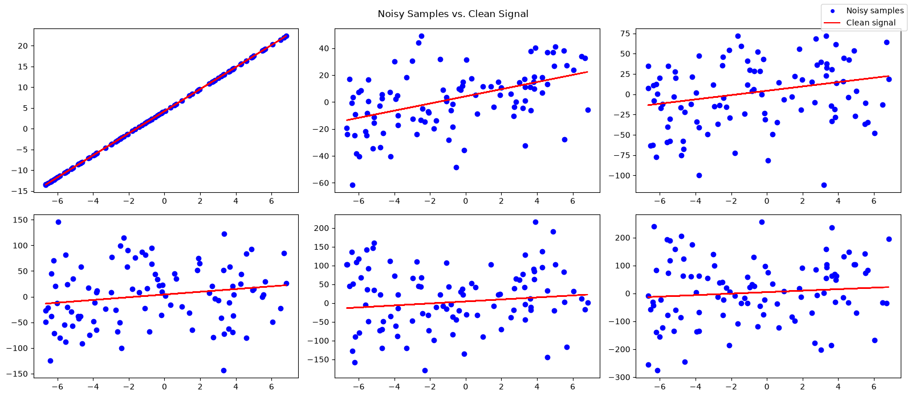
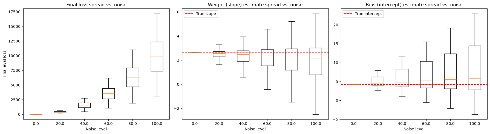
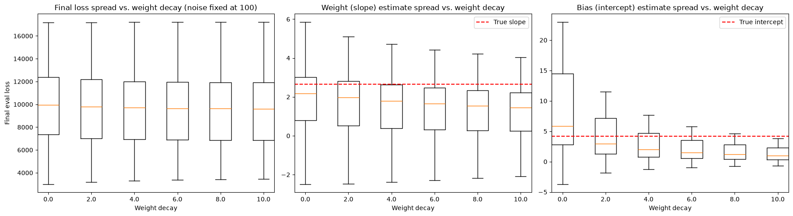

# Regularization as Variance Reduction in Linear Regression

A **tiny-torch** notebook that illustrates regularization — specifically L2 /
weight decay — as a **variance reduction** technique. It builds on the same
noise-vs-parameter-spread analysis as [`../variance/README.md`](../variance/README.md),
but adds a second step: once noise has been shown to inflate the spread of
the learned weight and bias, the notebook fixes the noise level and instead
sweeps the regularization strength, to see the spread shrink back down.

The signal to recover is:

```
f(x) = 2.66·x + 4.21   →   slope = 2.66, intercept = 4.21
```

The notebook is split in two steps:

1. Show how noise affects the model's weights and predictions (no regularization).
2. Show how regularization reduces that variance, with noise held fixed.

---

## Building the datasets

`generate_dataset(f, size, sample_size, noise_upto, min, max, seed)` draws a
single set of `x` samples on `[-7, 7]` and computes the clean signal `y = f(x)`
once, then builds `size` variants of it by adding Gaussian noise of
increasing standard deviation to `y`. The notebook builds `DATASETS_SIZE = 6`
datasets of `SAMPLE_SIZE = 100` points each, with `NOISE_UPTO = 100`, plus a
noise-free reference (`noise_upto=0`, same `SEED = 777`) used purely to draw
the true line alongside the noisy scatter:

```python
X = generate_dataset(f, size=DATASETS_SIZE, sample_size=SAMPLE_SIZE, noise_upto=NOISE_UPTO, min=MIN, max=MAX, seed=SEED)
X_clean = generate_dataset(f, size=DATASETS_SIZE, sample_size=SAMPLE_SIZE, noise_upto=0, min=MIN, max=MAX, seed=SEED)
```



---

## STEP 1 — Variance without regularization

For each noise level, `generate_noise_dataset` draws `N_REPEATS` independent
datasets — same `x` samples, same signal, but freshly sampled Gaussian noise
added to `y` each time. Every repeat gets its own `Trainer` (fresh
`Sequential(Linear(1, 1))`, `MSELoss`, `SGD`, `CosineSchedule`) and is trained
from scratch with `fit_model`:

```python
EPOCHS = 80
EVAL_STEP = 10
BATCH_SIZE = 16
N_REPEATS = 20
MAX_LR, MIN_LR = 1e-2, 1e-4

for noise in noise_levels:
    repeats = generate_noise_dataset(f, N_REPEATS, SAMPLE_SIZE, noise, MIN, MAX, SEED)
    tr, te = split_dataset(repeats, split_ratio=0.9, axis=1)

    for sample_tr, sample_te in zip(tr, te):
        loader_tr, loader_te = preprocess_dataloader(sample_tr, sample_te, BATCH_SIZE)
        trainer = create_trainer(IN_FEATURE, OUT_FEATURE, MIN_LR, MAX_LR, EPOCHS)

        fit_model(trainer, loader_tr, loader_te, EPOCHS, EVAL_STEP)
```

The final parameters and loss history of every repeat, at every noise level,
are collected into `all_params`, `all_train_loss` and `all_eval_loss`. Taking
the last evaluation loss of every repeat (`all_eval_loss[:, :, -1]`) and the
learned weight/bias (`all_params[:, :, 0, 0, 0]` / `all_params[:, :, 1, 0, 0]`),
a boxplot per noise level shows both the typical value and its spread across
repeats, with a dashed red line marking the true `SLOPE`/`INTERCEPT`.



**Consideration:** the weight, bias and final evaluation loss spread all
increase with the noise level — expected, since higher noise makes it harder
for the model to recover the underlying signal.

---

## STEP 2 — Reducing variance with weight and bias decay

Same training loop as Step 1, but with the noise level **fixed** at Step 1's
noisiest setting (`FIXED_NOISE = NOISE_UPTO`), and two *independent* decay
terms swept together instead: `weights_decay`, from `0` to
`WEIGHTS_DECAY_UPTO = 20`, and `bias_decay`, from `0` to `BIAS_DECAY_UPTO = 5`:

```python
BIAS_DECAY_UPTO = 5
WEIGHTS_DECAY_UPTO = 20
FIXED_NOISE = NOISE_UPTO  # keep noise fixed so the sweep isolates the decay effect

for w_decay, b_decay in zip(weights_decay_levels, bias_decay_levels):
    repeats = generate_noise_dataset(f, N_REPEATS, SAMPLE_SIZE, FIXED_NOISE, MIN, MAX, SEED)
    tr, te = split_dataset(repeats, split_ratio=0.9, axis=1)

    for sample_tr, sample_te in zip(tr, te):
        loader_tr, loader_te = preprocess_dataloader(sample_tr, sample_te, BATCH_SIZE)
        trainer = create_trainer(IN_FEATURE, OUT_FEATURE, MIN_LR, MAX_LR, EPOCHS, w_decay, b_decay)
        fit_model(trainer, loader_tr, loader_te, EPOCHS, EVAL_STEP)
```

`create_trainer`'s `weights_decay` and `bias_decay` arguments are forwarded
straight into `SGD(model.parameters, max_lr, weights_decay, bias_decay)`,
which applies L2 decay during the optimizer step — `weights_decay` only to
the `WEIGHTS_ROLE` parameter (the slope), `bias_decay` only to the
`BIAS_ROLE` parameter (the intercept). Because the two terms act on
different parameters, each can be swept on its own scale.



**Consideration:** with noise held fixed at Step 1's highest level,
increasing the decay terms visibly tightens both the weight and bias spread
and lowers the final evaluation loss — the variance-reduction effect
regularization is meant to demonstrate.

The trade-off is also visible: as the decay terms grow, the weight and bias
means drift away from the true `SLOPE`/`INTERCEPT` toward `0` — the classic
bias-variance tradeoff. Since `weights_decay` and `bias_decay` are two
independent regularization terms — the former penalizing only the slope,
the latter only the intercept — each can be tuned separately, and their
sweep ranges (`WEIGHTS_DECAY_UPTO` vs. `BIAS_DECAY_UPTO`) don't need to match.

---

## Run it

Open and run the notebook top to bottom:

```bash
jupyter notebook examples/linear_regression/regularization/L2/main.ipynb
```