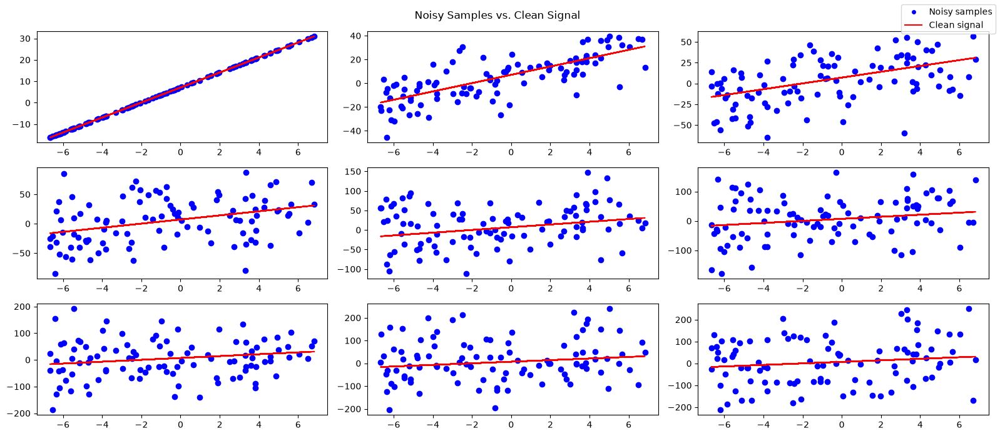
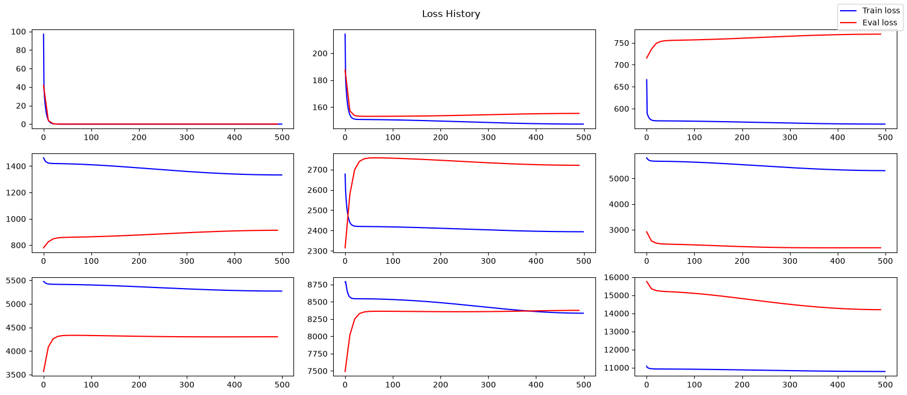
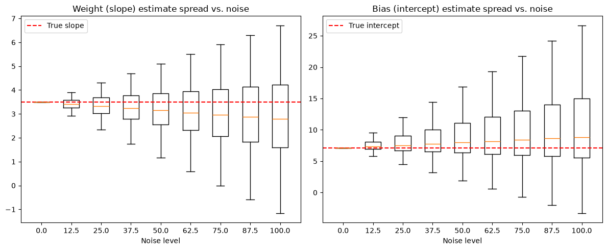

# Variance in Linear Regression

A **tiny-torch** notebook that studies how the amount of noise in the
training data affects a linear regression model. For nine increasing noise
levels, it trains **20 independent models** on freshly re-sampled noisy data
(180 models in total) and looks at the *spread* of the final loss and the
learned parameters across those repeats — not just a single run per noise
level.

The signal to recover is:

```
f(x) = 3.5·x + 7.1   →   slope = 3.5, intercept = 7.1
```

Every model only ever sees noisy `(x, y)` pairs — the goal is to see how far
increasing noise pushes the learned slope and intercept away from these true
values.

---

## Building the datasets

`generate_dataset(size, sample_size, noise_upto)` draws a single set of `x`
samples on `[-7, 7]` and computes the clean signal `y = f(x)` once, then
builds `size` variants of it by adding Gaussian noise of increasing standard
deviation to `y`:

```python
for noise in np.linspace(0, noise_upto, size):
    y_noise = y + rng.standard_normal(x.shape[0]) * noise
    ...
```

The noise levels are equally spaced between `0` and `noise_upto`, so the
first dataset in the stack is the clean signal itself and the last one is the
noisiest. The notebook builds `DATASETS_SIZE = 9` datasets of
`SAMPLE_SIZE = 100` points each, with `NOISE_UPTO = 100`, plus a
noise-free reference (`noise_upto=0`) used purely to draw the true line
alongside the noisy scatter:

```python
X = generate_dataset(size=DATASETS_SIZE, sample_size=SAMPLE_SIZE, noise_upto=NOISE_UPTO)
X_clean = generate_dataset(size=DATASETS_SIZE, sample_size=SAMPLE_SIZE, noise_upto=0)
```

Both datasets share the same `SEED`, so the noisy samples and the clean line
line up on the same `x` values, one subplot per noise level.



The first subplot is essentially noise-free — the blue points sit right on
the red line — and each subsequent subplot fans the points out further from
it, up to the last one where the line is barely recognizable inside the
scatter.

---

## Training with repeated trials

For each noise level, `generate_noise_dataset(size, sample_size, noise)`
draws `N_REPEATS` independent datasets: the same `x` samples and signal, but
freshly sampled Gaussian noise added to `y` on every repeat. Every repeat
gets its own `Trainer` trained from scratch, so the outcome reflects the
randomness of that one noisy sample rather than being averaged away:

```python
EPOCHS = 80
EVAL_STEP = 10
BATCH_SIZE = 1
N_REPEATS = 20
MAX_LR, MIN_LR = 1e-2, 1e-4

for noise in noise_levels:
    repeats = generate_noise_dataset(N_REPEATS, SAMPLE_SIZE, noise)
    tr, te = split_dataset(repeats, split_ratio=0.9, axis=1)

    for sample_tr, sample_te in zip(tr, te):
        trainer = create_trainer(IN_FEATURE, OUT_FEATURE, MIN_LR, MAX_LR, EPOCHS)
        loader_tr, loader_te = preprocess_dataloader(sample_tr, sample_te, BATCH_SIZE)
        fit_model(trainer, loader_tr, loader_te, EPOCHS, EVAL_STEP)
```

`create_trainer` wires up a `Sequential(Linear(1, 1))` with `MSELoss`, `SGD`
and a `CosineSchedule` annealing from `MAX_LR` to `MIN_LR`. `BATCH_SIZE` is
set to `1` to extract the best performance from each model. The final
parameters and loss history of every repeat, at every noise level, are
collected into `all_params`, `all_train_loss` and `all_eval_loss`.

---

## Loss history

Instead of a single final loss per noise level, there are now `N_REPEATS`
of them. Taking the last evaluation loss of every repeat
(`all_eval_loss[:, :, -1]`) and drawing one boxplot per noise level shows
both the typical loss and its spread across repeats at once:

```python
final_eval_loss = all_eval_loss[:, :, -1]  # (DATASETS_SIZE, N_REPEATS)
ax.boxplot(final_eval_loss.T, positions=noise_levels, widths=NOISE_UPTO/DATASETS_SIZE*0.6)
```

At low noise the boxes are small and sit near zero — every repeat converges
to essentially the same, tiny loss. As the noise level rises, both the
median loss and the box/whisker spread grow sharply: not only does the
model fit worse on average, but *which* noisy sample it happened to see
starts to matter a lot.



---

## Weights interpretation

Finally, the notebook extracts the learned weight and bias from every one of
the 180 trained models (`get_model_param`) and draws a boxplot per noise
level for each parameter, with a dashed red line marking the true value:

```python
weight_samples = all_params[:, :, 0, 0, 0]
bias_samples   = all_params[:, :, 1, 0, 0]

ax_w.boxplot(weight_samples.T, positions=noise_levels, widths=NOISE_UPTO/DATASETS_SIZE*0.6)
ax_w.axhline(SLOPE, color='red', linestyle='--', label='True slope')

ax_b.boxplot(bias_samples.T, positions=noise_levels, widths=NOISE_UPTO/DATASETS_SIZE*0.6)
ax_b.axhline(INTERCEPT, color='red', linestyle='--', label='True intercept')
```

At low noise every box hugs the dashed true-value line tightly. As the noise
level increases, the median estimate drifts away from `SLOPE`/`INTERCEPT`
*and* the boxes fan out — repeats at the highest noise level occasionally
recover a slope with the wrong sign entirely. This is the clearest, most
direct evidence that more variance in the training data makes the fitted
parameters both less accurate and less reliable, even when the loss on that
same noisy data looks acceptable.



---

## Why it happens

Ordinary least squares (and SGD, which approximates it) is unbiased in
expectation but not exact on any single finite sample. The variance of the
estimated slope and intercept grows with the variance of the noise in `y`
and shrinks as the number of samples grows — so for a fixed `sample_size`,
pushing `noise_upto` up spreads the `(x, y)` points further off the true
line, and gradient descent has to split the difference among noisier
observations. The loss can still look small (it's measured against noisy
targets, not the clean signal), while the parameters themselves wander
further from `SLOPE` and `INTERCEPT`. This is the same distinction explored
in [`../ill-cond/README.md`](../ill-cond/README.md): fitting the data well and
recovering the true, interpretable coefficients are two different things.

---

## Run it

Open and run the notebook top to bottom:

```bash
jupyter notebook examples/linear_regression/variance/main.ipynb
```