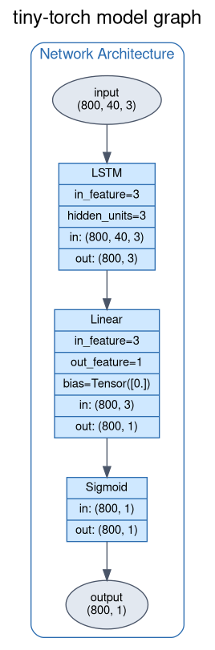
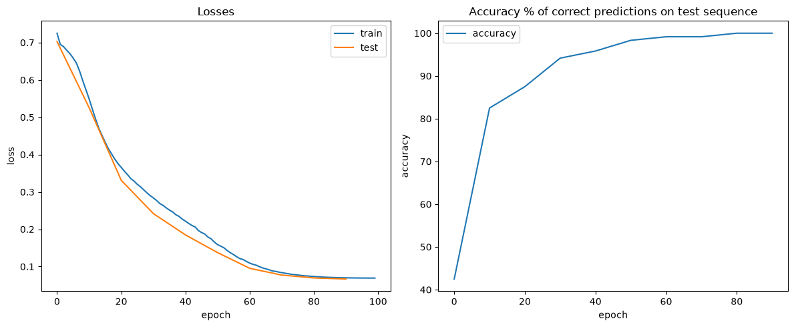

## LSTM  Long Short-Term Memory

The aim of this notebook is to show how to train a LSTM for binary classification.

### The Training Problem

Given a language grammar, the LSTM will be able to classify sequences of characters as valid or invalid according to the grammar rules.

BNF Definition:

$$
\begin{array}{rcl}
\langle\mathit{string}\rangle   & \mathrel{::=} & \langle\mathit{term}\rangle \\
                              & \mid          & \langle\mathit{string}\rangle \mathbin{\texttt{+}} \langle\mathit{term}\rangle \\[2pt]
\langle\mathit{term}\rangle   & \mathrel{::=} & AB, ED, OK \\[2pt]
\end{array}
$$

As you can see every terms follow the same logic, first a vowel and then a consonant.

## Why LSTM ?
An LSTM network is a particulary good choice because the problem encodes in his nature two important aspects:
- Memory
- Non-Linear temporal dependencies

### Memory
In order to determine if a sequence is valid or not, according to the grammar definition you must remember the last terms you have seen, considering that every terms has a proper logic.

### Non Linear temporal dependencies
In order to considering a sequence as valid or invalid you must consider the temporal dependencies between the characters composing the terms, in fact a sequence is valid if and only if every term is valid.

## Tokenizer

In order to represent the terms of the language we need to define a tokenizer that will map every letters of the alphabet to point in a vector space.
Our vector space has 3 dimensions:

- Is Vowel
- Is Consonant
- Position in alphabet

so every term will be represented as a 3D vector in this space.

## Architecture
Loss = Binary Cross Entropy

Optimizer = SGD

    

## Training Hyperparameters
- EPOCHS = 100
- Sequence Character Length = 40
- Batch Size = 16
- Learning Rate = 1e-1, 1e-4 (Cosine scheduler applied)

## Metrics
TRAIN LOSS IMPROVED BY *90.45%*

TEST LOSS IMPROVED BY *90.503%*

CORRECTS PREDICTION ON TEST SET ARE: *100.0%*

    

