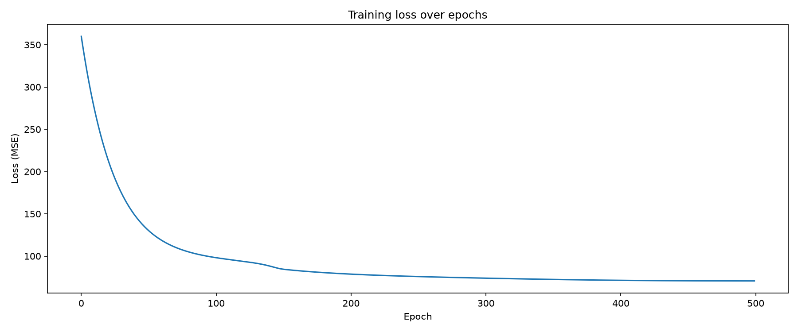
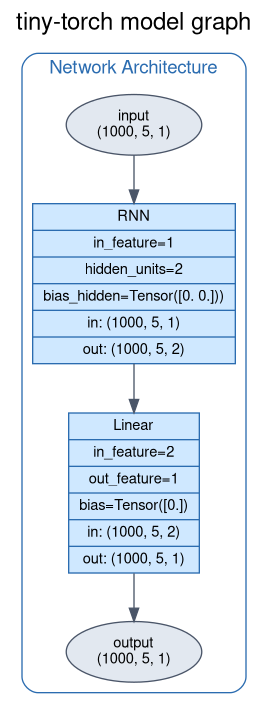

## Recurrent Neural Network (RNN)

The aim of this example is to show a full walkthrough of implementing an RNN, first from scratch using only NumPy, and then again using thorcino (this framework), turning the same recurrence into a reusable and composable module.

The example is split across two notebooks:

- [scratch.ipynb](./scratch.ipynb) — the from-scratch implementation. It hand-derives and hand-codes the forward pass (`compute_H`, `compute_output`), Back Propagation Through Time (`backward`), and a plain SGD optimizer (`update`/`optimize`), all with raw NumPy arrays and dicts of parameters. This is where the math in this README (hidden-state recurrence, BPTT gradients, SGD update rule) is implemented step by step and is the best place to start to understand *how* an RNN actually learns.
- [main.ipynb](./main.ipynb) — the thorcino implementation. It builds the same next-number-in-sequence task on top of the framework's own `RNN` layer (`thorcino.layers.RNN`) wrapped in a `Sequential` model, trained with `thorcino.optimizer.SGD`, a `CosineSchedule`, and the `Trainer`/`DataLoader` utilities. It also renders the model's computation graph to [images/arch.png](./images/arch.png), [images/forward.png](./images/forward.png) and [images/backward.png](./images/backward.png) via `model.save_graph(...)`, and reports per-time-step prediction tables (expected vs. predicted, with % error) for both a held-out test sequence and a training sequence.

## Introduction

A RNN is a type of neural network that embed the concept of time **implicity** in the model. This is done by using a hidden state that carry the information from the previous time step to the next one, recursively. This allows the model to have a memory of the past inputs and use it to make predictions on the current input.

**implicity** means that *time* is **not** and explicit input dimension/axes, it's not encoded into the input data, but it's implicitly present in how model learn.

The RNN can learn through a variation of classic Back Propagation algorithm called Back Propagation Through Time (BPTT). This algorithm is used to train RNNs by unrolling the network in time and applying the standard backpropagation algorithm to the unrolled network.

## The Learning Task

Both notebooks train the RNN on a simple, but general enough, task: predicting the next number in a sequence of equidistant ordered numbers. Random sequences are generated with NumPy, and for each sequence the input $X$ is the sequence itself while the target $Y$ is the same sequence shifted by one step.

## Notation

$t$ is the time step

$n$ is the number of samples (or the batch size)

$d$ is the number of input for each sample (or the number of features)

$h$ is the number of hidden units

$\mathbf{H}_t \in \mathbb{R}^{n \times h}$ is the hidden state at time step $t$.

$\mathbf{X}_t \in \mathbb{R}^{n \times d}$ is the input at time step $t$.

$\mathbf{W}_{xh} \in \mathbb{R}^{d \times h}$ is the weight matrix (shared across time step!)

$\mathbf{W}_{hh} \in \mathbb{R}^{h \times h}$ is the hidden-state-to-hidden-state weight matrix (shared across time step!)

### The output of an RNN is:

$$
\mathbf{O}_t = \phi_o \left( \mathbf{H}_t \mathbf{W}_{ho} + \mathbf{b}_o \right)
$$

Where $\mathbf{H}_t$ equals:

$$
\mathbf{H}_t = \phi_h \left( \mathbf{X}_t \mathbf{W}_{xh} + \mathbf{H}_{t-1} \mathbf{W}_{hh} + \mathbf{b}_h \right)
$$

## Gradient computation (Back Propagation Through Time)

The loss over a sequence is the sum of the per-step losses:

$$
\mathcal{L} \left( \mathbf{O}, \mathbf{Y} \right)
= \sum_{t=1}^{T} \ell_t \left( \mathbf{O}_t, \mathbf{Y}_t \right)
$$

Since $\mathbf{W}_{xh}$ and $\mathbf{W}_{hh}$ are shared across all time steps, their gradients accumulate contributions from every step, unrolled back through time:

$$
\begin{aligned}
\frac{\partial \mathcal{L}}{\partial \mathbf{W}_{hh}}
&= \sum_{t=1}^{T} \frac{\partial \ell_t}{\partial \mathbf{O}_t}
   \cdot \frac{\partial \mathbf{O}_t}{\partial \phi_o}
   \cdot \mathbf{W}_{ho}
   \sum_{k=1}^{t} \left( \mathbf{W}_{hh}^{\top} \right)^{t-k}
   \cdot \mathbf{H}_k \\[1em]
\frac{\partial \mathcal{L}}{\partial \mathbf{W}_{xh}}
&= \sum_{t=1}^{T} \frac{\partial \ell_t}{\partial \mathbf{O}_t}
   \cdot \frac{\partial \mathbf{O}_t}{\partial \phi_o}
   \cdot \mathbf{W}_{ho}
   \sum_{k=1}^{t} \left( \mathbf{W}_{hh}^{\top} \right)^{t-k}
   \cdot \mathbf{X}_k
\end{aligned}
$$

In [scratch.ipynb](./scratch.ipynb), this is implemented explicitly by iterating backwards over the cached time steps, accumulating the gradients of `Wxh`, `Whh`, `bh`, `Who` and `bo`, and propagating the hidden-state gradient (`dH_next`) to the previous time step. In [main.ipynb](./main.ipynb) the same BPTT recurrence is handled internally by thorcino's autograd engine when `Trainer` backpropagates through the unrolled `RNN` layer.

## Optimizer: Stochastic Gradient Descent (SGD)

The network is trained with plain SGD, with optional weight decay ($\lambda$) on the weight matrices (not on the biases), and a cosine learning-rate schedule that anneals the learning rate from a max to a min value over the training epochs:

$$
\begin{equation}
\hat{g}_t^{(i)} =
\begin{cases}
\nabla_\theta \mathcal{L}(\theta_t^{(i)}) + \lambda \, \theta_t^{(i)} & \text{if } \theta^{(i)} \in \mathcal{W} \\[4pt]
\nabla_\theta \mathcal{L}(\theta_t^{(i)}) & \text{otherwise}
\end{cases}
\end{equation}

\begin{equation}
\theta_{t+1}^{(i)} = \theta_t^{(i)} - \eta \, \hat{g}_t^{(i)}
\end{equation}
$$

## Training and Inference

### scratch.ipynb

Each training step runs a full forward pass over the sequence (`forward`), computes the loss with a hand-rolled MSE (`thorcino.functions.mse`), backpropagates through time (`backward`), and applies a manual SGD step (`optimize`) — 100 epochs, `MAX_LR=1e-3`, `MIN_LR=1e-6`, cosine-annealed, on `N=10` sequences of length `T=5` with `H=2` hidden units. Inference (`infer`) reuses the same forward recurrence, without computing the loss, to roll the hidden state forward and produce a prediction at each time step.

The plot above shows the training loss (summed MSE over the sequence) across the 100 training epochs used in the notebook. The loss drops sharply in the first epochs, thanks to the higher learning rate at the start of the cosine schedule, then keeps decreasing more gradually as the learning rate anneals towards `MIN_LR`, indicating the RNN is converging on the next-number-in-sequence task.

### main.ipynb

The thorcino version trains the same task through the framework's `Trainer`: each epoch calls `trainer.train_epoch(loader_tr)` over batches from a `DataLoader`/`TensorDataset` pair, with periodic `trainer.eval(loader_te)` calls on a held-out test set. The model is a single `RNN` layer (`d=1` input feature, `h=2` hidden units, `o=1` output feature, `Identity` activations) inside a `Sequential`, trained for 50 epochs with `SGD` (`MAX_LR=1e-5`, `MIN_LR=1e-8`, momentum `0.7`) under a `CosineSchedule`, on `N=1000` random sequences of length `T=5` (`min_start=30` for training, `min_start=45` for testing). Before training, `model.save_graph(...)` dumps the model's static architecture and the forward/backward computation graphs to [images/arch.png](./images/arch.png), [images/forward.png](./images/forward.png) and [images/backward.png](./images/backward.png).

The graph above shows the static architecture rendered by `model.save_graph(...)`: the `Sequential` model wraps the `RNN` layer (`in_feature=1`, `hidden_units=2`) feeding into a `Linear` layer (`in_feature=2`, `out_feature=1`), with the input/output tensor shapes `(1000, 5, 1)` for the `N=1000`, `T=5` sequence data used in the notebook.

At inference time (`model.eval()` + a forward call), the notebook prints per-time-step comparison tables (expected vs. predicted vs. % error) for a test sequence and a training sequence, showing errors in roughly the 2–13% range across the 5 steps — the prediction error grows with `t` since each step's hidden state compounds the approximation error of the previous one.

---

Resources:

[Recurrent Neural Networks (RNNs): A gentle Introduction and Overview - Robin M. Schmid](https://arxiv.org/abs/1912.05911)

[Finding Structure in Time - Jeffrey L. Elman](https://onlinelibrary.wiley.com/doi/epdf/10.1207/s15516709cog1402_1)