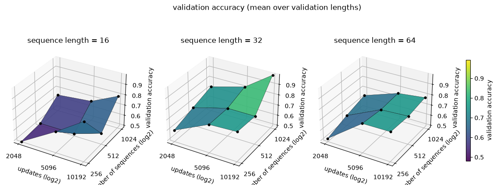
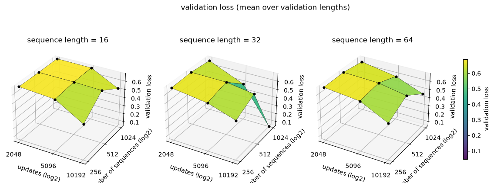
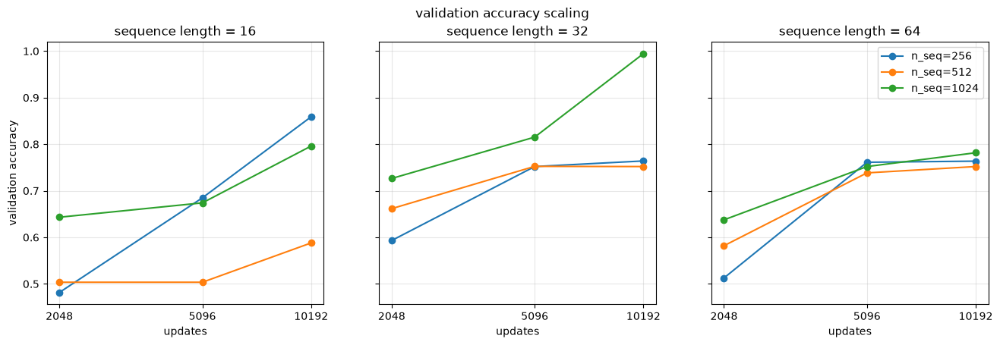
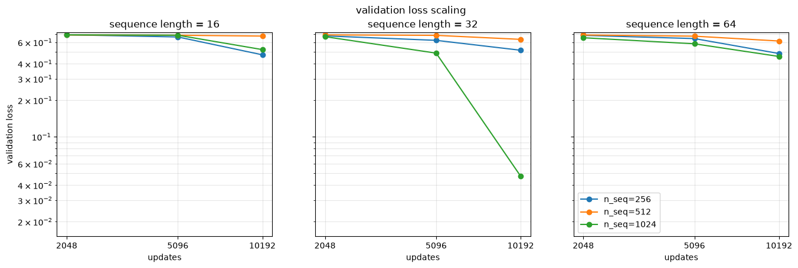

# What actually makes a tiny LSTM learn? A full factorial experiment

Most of the time, when we touch hyperparameters, we are *tuning*: searching for the
combination that gives the best number. This experiment does something else. It treats
the hyperparameters as **factors in a designed experiment** and asks a measurement
question instead of an optimisation one:

> When I change the training budget, the amount of data, or the length of the sequences,
> *how much does the model's behaviour actually move* — and how much of that movement is
> just the luck of the initial weights?

The model under test is deliberately unimpressive: the same 3-unit LSTM from the
[lstm](../lstm/README.md) example. That is the point. A small model on a small task makes
the *methodology* visible — the replication, the paired seeds, the error bars — instead of
burying it under a leaderboard score.

What comes out is a small, honest, empirical scaling law. Not one you would cite, but one
you can fully audit.

> **AI disclaimer.** A large part of [helpers.py](./helpers.py) is AI written.

**The two files:**

- [main.ipynb](./main.ipynb) — the notebook: configuration, model factory, validation
  set, the sweep, and the analysis. Kept as thin as possible on purpose.
- [helpers.py](./helpers.py) — everything mechanical: the `Experiment` driver, the seed
  streams, artifact naming and parsing, checkpoint recovery, the metric loaders
  (`collect_samples`, `metric_grid`, `metric_band`, `replication_report`) and the
  plotting layer (`plot_metric_surfaces`, `plot_metric_scaling`).


## The task: is this string in the language?

Given a tiny formal grammar, the network has to classify a string of characters as valid
or invalid.

$$
\begin{array}{rcl}
\langle\mathit{string}\rangle   & \mathrel{::=} & \langle\mathit{term}\rangle \\
                              & \mid          & \langle\mathit{string}\rangle \mathbin{\texttt{+}} \langle\mathit{term}\rangle \\[2pt]
\langle\mathit{term}\rangle   & \mathrel{::=} & AB, ED, OK \\[2pt]
\end{array}
$$

A valid string is a concatenation of two-character terms, each one of `AB`, `ED`, `OK` —
a vowel followed by a consonant. To answer, the model must carry state across time (*where
am I inside a term?*) and combine it non-linearly (*the string is valid **iff** every term
is*). That is what a recurrent cell is for.

Each dataset comes from `examples.helpers.dataset.get_dataset(row, col)`. Half the
sequences are generated from the grammar, half drawn uniformly from the alphabet — but
**every** label is obtained by actually parsing the string, so on the rare occasion a
random draw happens to be grammatical, it is still labelled correctly. Characters are
tokenized into three dimensions — *(is vowel, is consonant, position in the alphabet)* —
giving `X` of shape `(row, col, 3)` and `Y` of shape `(row, 1)`. Terms are two characters
wide, so sequence lengths are always even.

### Architecture

```
Sequential(
    LSTM(in_feature=3, hidden_units=3, out_type='n_to_1'),
    Linear(in_feature=3, out_feature=1),
    Sigmoid(),
)
BinaryCrossEntropyLoss()
SGD()
CosineRestartSchedule()
```

<p align="center">
    
</p>


## The three factors

A full factorial design means picking a few levels per factor and running *every*
combination. Three factors at three levels is 27 design points.

| Factor | Levels | What it is |
| --- | --- | --- |
| `updates` | 2048, 5096, 10192 | how long we train: optimizer steps, rounded up to a whole epoch |
| `number_of_sequence` | 256, 512, 1024 | how much data: axis 0 of the input |
| `sequence_length` | 16, 32, 64 | how hard the memory problem is: axis 1, in characters (even) |

The budget is deliberately expressed in **updates**, not epochs. An epoch is a different
amount of learning at each dataset size, so "100 epochs at 256 sequences" versus "100
epochs at 1024 sequences" would quietly confound the budget with the data. Updates are
the common currency; epochs are derived:

$$
\text{updates per epoch} = \left\lceil \frac{\text{split ratio} \times \text{number of sequences}}{\text{batch size}} \right\rceil
\qquad\Longrightarrow\qquad
\text{epochs} = \left\lceil \frac{\text{updates}}{\text{updates per epoch}} \right\rceil
$$

Everything else is nailed down so the three factors are the only moving parts: batch size
16; a cosine learning rate `MAX_LR=1e-2 -> MIN_LR=1e-4`, **restarted at each checkpoint**;
token dimension 3; a 0.9 train/test split; base seed 777, split into the two streams
described next.


## Replication, and the two seed streams

Here is the part that is easy to skip and expensive to skip.

A factorial design with **one run per cell has no error term**. There is nothing to
compare a factor effect *against*, so every difference between two cells looks like a
result. On this task the spread across initialisations turns out to be larger than every
factor effect except the training budget — meaning a single run per cell reports noise as
signal. So every cell is trained once per entry of `SEEDS` (`(0, 1, 2)` by default, passed
as `Experiment(seeds=...)`).

The base seed is never used directly. It is the base of two separate streams:

| Stream | Derivation | Keyed on | What it buys |
| --- | --- | --- | --- |
| dataset | `data_seed_for(seed, n_seq, s_len)` | the cell | every replicate of a cell trains on the same sequences |
| weights + shuffle | `init_seed_for(seed, replicate)` | the replicate | replicate `r` starts from the same weights in *every* cell |

The obvious alternative — seed once, let the draws run on — is simpler and subtly wrong.
`get_dataset` consumes a number of random draws that depends on *both* the dataset size
and the sequence length, so the weight initialisation would land on a different arbitrary
draw in every cell, confounded with both factors.

Two consequences worth stating out loud:

- The spread across replicates is **initialisation noise alone**, not initialisation
  noise plus a fresh data draw.
- The design is **paired**: comparing two cells compares them over a shared set of
  initialisations, so the seed noise common to both cancels instead of adding.

### Why the median, never the best

The response on this task is close to bimodal: a run either sits at the chance plateau
(loss $\ln 2 \approx 0.69$) or it solves the task. Reporting the **best** run of a cell
would therefore be actively misleading — the best of `k` draws is a biased estimator whose
bias grows with the cell's variance, so cherry-picking makes a *noisy* cell look better
than a stable one.

The analysis reports the **median** over replicates with a **min-max band**.
`metric_grid` does expose `reduce='min'`, but that is for the question *"what is the best
model I can get?"* — never for comparing factor levels.


## The experiment: 27 design points for the price of 9 runs

The grid is swept only over **number of sequences x sequence length x replicate** — 9
cells x `len(SEEDS)` runs. The *updates* factor is **not** swept. Each run trains to the
largest budget and a checkpoint is harvested at every smaller budget along the way, which
yields the full 3 x 3 x 3 = 27 design points per replicate for the cost of the largest
budget alone. One replicate of the whole grid is roughly 30 minutes, so cost scales
linearly with `len(SEEDS)`.

That substitution is only sound if a harvested checkpoint is interchangeable with a run
that was *meant* to stop there. A single cosine spanning the whole run would break it: the
2048-update checkpoint would still be near `MAX_LR` while the 10192-update one had
annealed to `MIN_LR`, and the budget axis would be confounded with the learning rate.

The schedule therefore **restarts the cosine at each checkpoint**, annealing
`MAX_LR -> MIN_LR` inside every segment — so each harvested checkpoint is a fully annealed
model of its own budget.

### The validation set

The problem is length-independent, so models are scored against a **shared** validation
set built as one sub-set per sequence length — `[8, 16, 32, 64, 96]`, 500 sequences each —
spanning both below and well above the lengths seen in training (16, 32, 64). That is what
makes length generalization *visible* rather than assumed. It is seeded once and kept
fixed, so a re-run scores its models against exactly the same data.

Each validation artifact therefore holds three parallel lists of five entries —
`sequence_lengths`, `loss_history`, `accuracy_history` — one entry per validation
**length**, *not* a per-epoch curve. Collapsing that axis is the analysis' first job.

### Artifacts and checkpoint recovery

An interrupted notebook can simply be re-run: completed runs are skipped, and a partially
finished one resumes from its last checkpoint. A checkpoint counts as complete only when
**all three** of its artifacts exist — `scan_checkpoints` intersects the three folders, so
an id that only reached the backup before the interruption is recomputed instead of being
trusted as done.

Three artifacts per checkpoint, under `checkpoint/` (generated locally, not committed):

| Folder | Content |
| --- | --- |
| `checkpoint/backup` | full trainer state (model, optimizer, scheduler) |
| `checkpoint/metrics/training` | the training metrics of the run |
| `checkpoint/metrics/validation` | the scores against the shared validation set |

All three share one deterministic name, which is the **only** record of the setup that
produced a checkpoint:

```
E<experiment id>__<epochs>_<updates>_<n_sequence>_<sequence_length>_S<seed>__<age>s.pkl
```

e.g. `E2__680_10200_256_16_S0__139s.pkl`. `parse_artifact` turns it back into an
`ExperimentInfo`, which is what lets the analysis group runs by factor and by replicate
without reopening every pickle.

Three details hide in that filename:

- `_S<seed>` is **optional** in the pattern, so artifacts written before the study was
  replicated still parse. They come back with `seed=None` and are reported as a single
  unreplicated draw, rather than being silently counted as one seed of a band.
- Experiment ids are laid out cell-major, then replicate, then checkpoint, so
  **appending** a seed to `SEEDS` renumbers nothing already on disk.
- `<updates>` records `trainer.step`, the steps *actually* taken. Epochs are integral, so
  a run overshoots its requested budget by up to one epoch — and by a different amount at
  every dataset size (a 2048 budget lands on 2055, 2059 or 2088). `budget_index` maps the
  recorded count back onto the requested budget instead of matching it directly.


## Reading the results

Three factors and one response are four dimensions; a surface carries three. So the
sequence length is spent on the **panels** rather than on an axis: each panel is a real
`updates x number of sequences` slice at one length, not a projection that averages a
factor away.

Both factor axes are put on a common footing by `log_scale`, which converts a level list
to $\log_2$ distance from its middle level (`[256, 512, 1024]` becomes `[-1, 0, 1]`) — the
natural axis for a scaling law, since the levels grow geometrically and on a linear axis
the largest would swallow the plot. The **surfaces show the shape** of the response; the
**log-log curves show its rate**, since a slope there is the exponent the study is after.
On a 3x3 grid a surface is only four quads drawn between nine real measurements, which is
why the measurements themselves are marked with black dots.

Two reductions happen before anything is drawn:

1. **Over validation lengths.** `eval_index=None` averages over the entries of
   `VAL_SEQUENCE_LENGTHS`; an integer picks one.
2. **Over replicates.** Surfaces and curves plot the **median**; the curves also shade the
   **min-max** range. That band is the only part of the figure showing the noise floor, so
   a factor effect is readable as an effect *where it clears the band, and nowhere else*.
   Cells with no artifact stay `NaN` rather than 0, so a hole in the sweep reads as missing
   instead of as a perfect score.

And before the plots, read `replication_report`. It prints how many replicates each design
point actually has, broken out by every factor including sequence length. The failure mode
it guards against is specific: a cell holding a single artifact still draws — as a line
with a **zero-width band** — which looks like a precise measurement rather than a missing
one.


## Results

> **A caveat on the figures below.** They come from the earlier **unreplicated** sweep —
> one run per cell, no seed field in the artifact names — which is precisely the design
> that motivated the replication described above. They are kept because they locate the
> binding factor and show why an error term was needed; the numbers in the flat panels
> should not be read as measured effects. Re-running the notebook with `SEEDS = (0, 1, 2)`
> regenerates them with median lines and min-max bands.

All 27 design points below are measured rather than interpolated (the black dots on the
surfaces are the measurements).

### The shape of the response

<p align="center">
    
</p>

<p align="center">
    
</p>

Accuracy tilts upward along the updates axis in all three panels: the budget is the factor
that moves the response, and no panel has saturated at 10192 updates. The dataset-size
axis is much flatter and, at length 16, not even monotonic. The loss surface is nearly
flat by comparison — every cell but one sits in a narrow 0.45–0.63 band, so on this grid
the loss mostly fails to separate design points that accuracy already separates.

### The rate

<p align="center">
    
</p>

<p align="center">
    
</p>

Read as a scaling law, the flat panels are the interesting part:

- **The budget is the binding constraint.** Almost every curve is still rising at the
  largest budget, and at 2048 updates several cells sit at or below 0.6 accuracy — the
  256-sequence cells start near chance (~0.48–0.59). At this scale the models are
  *undertrained*, not data starved. This is the one effect large enough to clear the seed
  spread.
- **One cell actually solves the task.** 1024 sequences x length 32 x 10192 updates
  reaches ~0.99 accuracy and a loss of ~4.5e-2, an order of magnitude below every other
  point in the study. That single point is what breaks the loss colour scale and makes the
  other 26 look flat.
- **More data is not uniformly better.** At length 16 the 512-sequence line is pinned at
  chance (~0.50) through 5096 updates and only reaches ~0.59, while both 256 and 1024 pass
  0.79. A monotone dataset-size effect would not do that. With one seed per cell this is
  run-to-run variance showing through the design — exactly what the min-max band exists to
  expose.
- **Length costs accuracy, not learnability.** The length-64 panel reaches roughly the
  same ~0.75–0.78 plateau as length 32 but climbs to it more slowly: the expected cost of a
  longer credit-assignment path through a 3-unit LSTM.


## The honest summary

This grid measures the *shape* of the response well enough to locate the binding factor —
the update budget — and it does **not** have the resolution to fit an exponent. Three
levels per factor is a coarse ruler, and on this run a single cell carries most of the
signal.

Replication supplies the missing error term. Widening the grid is what would turn these
curves into an actual fitted law.
