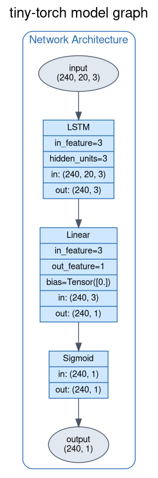

## Full Factorial: the scaling law of a recurrent network

The aim of this example is to measure *how* the training of a recurrent network
responds to changes in its hyperparameters, instead of just tuning them. The same
LSTM of the [lstm](../lstm/README.md) example is trained over a full factorial design
across three factors — **update budget**, **number of sequences** and **sequence
length** — and every design point is checkpointed, so the resulting curves can be read
as an (empirical, very small scale) scaling law.

The example is made of two files:

- [main.ipynb](./main.ipynb) — the notebook: hyperparameter configuration, model
  factory, validation set, the sweep itself and the analysis of the collected metrics.
- [helpers.py](./helpers.py) — all the "business logic" behind the notebook: the
  `Experiment` driver, the artifact naming/parsing, checkpoint recovery, the metric
  loading utilities and the plotting layer (`metric_grid`, `plot_metric_surfaces`,
  `plot_metric_scaling`). The notebook is kept as thin as possible on purpose.


## The Training Problem

The task is the same binary classification problem of the [lstm](../lstm/README.md)
example: given a language grammar, classify a sequence of characters as valid or
invalid according to the grammar rules.

BNF Definition:

$$
\begin{array}{rcl}
\langle\mathit{string}\rangle   & \mathrel{::=} & \langle\mathit{term}\rangle \\
                              & \mid          & \langle\mathit{string}\rangle \mathbin{\texttt{+}} \langle\mathit{term}\rangle \\[2pt]
\langle\mathit{term}\rangle   & \mathrel{::=} & AB, ED, OK \\[2pt]
\end{array}
$$

Each dataset is built by `examples.helpers.dataset.get_dataset(row, col)`: half of the
sequences are generated from the grammar and half drawn uniformly from the alphabet,
and **every** label is obtained by parsing the sequence — so the random half is still
labelled correctly on the rare occasions it happens to be grammatical. Characters are
tokenized into the 3-dimensional space *(is vowel, is consonant, position in alphabet)*,
giving `X` of shape `(row, col, 3)` and `Y` of shape `(row, 1)`. A term is two
characters wide, hence the sequence length must be even.


## Architecture

```
Sequential(
    LSTM(in_feature=3, hidden_units=3, out_type='n_to_1'),
    Linear(in_feature=3, out_feature=1),
    Sigmoid(),
)
```

Loss = Binary Cross Entropy — Optimizer = SGD — Scheduler = `CosineRestartSchedule`

<p align="center">
    
</p>


## The Hyperparameters

The three factors under study:

| Factor | Levels | Meaning |
| --- | --- | --- |
| `updates` | 2048, 5096, 10192 | requested optimizer steps, rounded up to a whole epoch |
| `number_of_sequence` | 256, 512, 1024 | axis 0 of the input data, the dataset size |
| `sequence_length` | 16, 32, 64 | axis 1 of the input data, in characters (must be even) |

Note that the budget is expressed in **updates**, not epochs. One epoch performs

$$
\text{updates per epoch} = \left\lceil \frac{\text{split ratio} \times \text{number of sequences}}{\text{batch size}} \right\rceil
\qquad\Longrightarrow\qquad
\text{epochs} = \left\lceil \frac{\text{updates}}{\text{updates per epoch}} \right\rceil
$$

which is *not* `number_of_sequence / batch_size`: only `split_ratio` of the data is
trained on, and the `DataLoader` emits a short final batch that still produces a full
update. `updates_per_epoch` / `epochs_for` in [helpers.py](./helpers.py) implement this,
and `Experiment.plan` asserts that two budgets never collide on the same epoch.

Everything else is held constant, so the factors are the only thing that varies:

- Batch size = 16
- Learning rate: `MAX_LR=1e-2`, `MIN_LR=1e-4`, cosine, **restarted at each checkpoint**
- Token dimension = 3
- Split ratio (train/test) = 0.9
- Seed = 777 — grid cell `i` is reseeded with `777 + i` (both `numpy`, which draws the
  sequences, and `random`, which drives the `DataLoader` shuffle), so the dataset is a
  controlled variable rather than noise: re-running a cell rebuilds exactly the same data.


## The Experiment

The grid is swept only over **number of sequences x sequence length** (9 runs). The
*updates* factor is **not** swept: each run is trained to the largest budget and a
checkpoint is harvested at every smaller budget along the way, which gives the full
3 x 3 x 3 = 27 design points for the cost of the largest budget alone.

That substitution is only sound if a harvested checkpoint is interchangeable with a run
of that budget, and a single cosine spanning the whole run would break it: the
2048-update checkpoint would still sit near `MAX_LR` while the 10192-update one had
annealed to `MIN_LR`, so the updates factor would be **confounded with the learning
rate**. `CosineRestartSchedule` therefore restarts the cosine at every checkpoint
epoch, annealing `MAX_LR -> MIN_LR` inside each segment, so every harvested checkpoint
is a fully annealed model of its own budget.

The one thing the restart does not buy back is the training history: the 10192-update
checkpoint is a run with two warm restarts behind it, not a fresh run of a single
cosine over 10192 updates. The updates factor is therefore still (monotonically)
confounded with the number of restarts, which is the price of paying for 27 design
points with 9 runs.


### Validation Set

The problem is length independent, so the models are scored against a **shared**
validation set made of one sub-set per sequence length — `[8, 16, 32, 64, 96]`, 500
sequences each — spanning both below and well above the lengths seen in training
(16, 32, 64), which is what makes length generalization visible. It is seeded once and
kept fixed, so a re-run scores its models against exactly the same data.

Each validation artifact therefore holds three parallel lists of five entries —
`sequence_lengths`, `loss_history`, `accuracy_history` — one entry per validation
length, **not** a per-epoch curve. Collapsing that axis is the analysis' first job.

`Experiment.evaluate` runs this sweep with `record=False`: `Trainer.eval` would
otherwise append to the same `history['eval_loss']` / `history['accuracy']` lists the
periodic test evaluation writes to, and the validation entries would interleave with
the training curve, making every later checkpoint save a curve no longer aligned with
its epochs.


### Artifacts and checkpoint recovery

Three artifacts are written per checkpoint, under [checkpoint/](./checkpoint):

| Folder | Content |
| --- | --- |
| `checkpoint/backup` | full trainer state (model, optimizer, scheduler) |
| `checkpoint/metrics/training` | the training metrics of the run |
| `checkpoint/metrics/validation` | the scores against the shared validation set |

All three share the same deterministic name, which is the only record of the setup a
checkpoint was produced with:

```
E<experiment id>__<epochs>_<updates>_<n_sequence>_<sequence_length>__<age>s.pkl
```

e.g. `E2__680_10200_256_16__139s.pkl`. `parse_artifact` turns it back into an
`ExperimentInfo`, which is what lets the analysis group runs by factor without reopening
every pickle.

Note that `<epochs>` and `<updates>` are what the trainer *actually* did, not what was
asked for: a budget is rounded up to a whole epoch, so the 10192-update level of a
256-sequence cell (15 updates per epoch) is really 680 epochs and 10200 updates.

Because the id is deterministic, an interrupted notebook can simply be re-run:
`Experiment.scan_checkpoints` intersects the three folders and a checkpoint counts as
complete only when all three artifacts are present (a partially written one is reported
and recomputed). Completed cells are skipped, and a partially finished cell resumes from
the last *contiguous* checkpoint — stopping at the first gap keeps the resumed trainer's
history contiguous.


## Running it

From the repository root (the notebook imports `examples.recurrent.scaling_law.helpers`,
so the root must be on the path):

```bash
uv sync --all-groups
```

The dev group ships `ipykernel` (the kernel) but not JupyterLab, so open
[main.ipynb](./main.ipynb) in an editor pointed at the `.venv` kernel — or add the
browser UI yourself with `uv add --dev jupyterlab`.

Then run the cells top to bottom. The sweep is the expensive cell; whatever is already
in [checkpoint/](./checkpoint) is recovered and skipped, so it only trains the design
points that are missing. Deleting the folder makes the notebook retrain the whole grid
from scratch. Cost is driven by the sequence length, since the update budget is fixed
per cell: the cheapest cell (256 sequences, length 16) takes about 140 s on CPU, so the
full 9-run grid is of the order of an hour. The per-run wall clock is recorded in the
`<age>s` field of each artifact name.


## Analysis

The metrics are reloaded with `FullFactorialMetrics(folder)`, which walks a checkpoint
folder and pairs every `Artifact` with the `ExperimentInfo` parsed from its name. The
notebook then groups them by sequence length, and the plotting layer takes over.

Three factors and one response are a 4-dimensional object, while a surface can only show
two factors against one response. The sequence length is therefore spent on the
**panels** — one plot per level — so each panel is a genuine 2-factor slice rather than
a projection that hides a factor:

| Function | What it draws |
| --- | --- |
| `metric_grid` | the `(number_of_sequence, updates)` grid of one metric, for one panel |
| `plot_metric_surfaces` | one 3D surface per sequence length, shared colour and z scale |
| `plot_metric_scaling` | the same data as flat log-log curves, one line per dataset size |

`metric_grid` is where the validation-length axis is collapsed: `eval_index` picks a
single validation length, `None` (the default) averages over all five. Cells with no
artifact stay `NaN` rather than `0`, so a hole in the sweep reads as missing instead of
as a perfect score.

Both factor axes are put on a common footing with `log_scale`, which converts a level
list to $\log_2$ distance from its middle level (`[256, 512, 1024]` becomes
`[-1, 0, 1]`) — the natural axis for a scaling law, since the levels grow geometrically
and on a linear axis the largest one would dominate the plot. The surfaces show the
*shape* of the response; the log-log curves show its *rate*, since a slope there is the
exponent the study is after. On a 3x3 grid a surface is only four quads drawn between
nine real measurements, which is why the measurements themselves are marked with black
dots.

> **Status:** work in progress. Only the first grid cell is on disk (3 of the 27 design
> points: 256 sequences x length 16), so the remaining 8 runs still have to be trained.
> The plotting cells also do not run yet against these artifacts: `metric_grid` looks up
> `metadata.updates` in `hyperparams['updates']`, but the name records the *actual* step
> count (10200) while the factor level is the *requested* budget (10192), so the lookup
> raises. Either the requested budget has to be recorded in the artifact name, or the
> grid has to be indexed by checkpoint position instead of by value.
